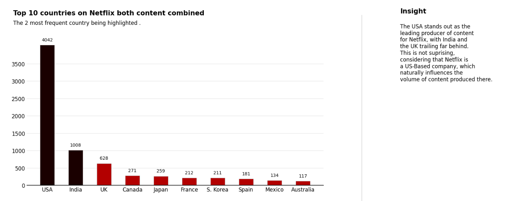
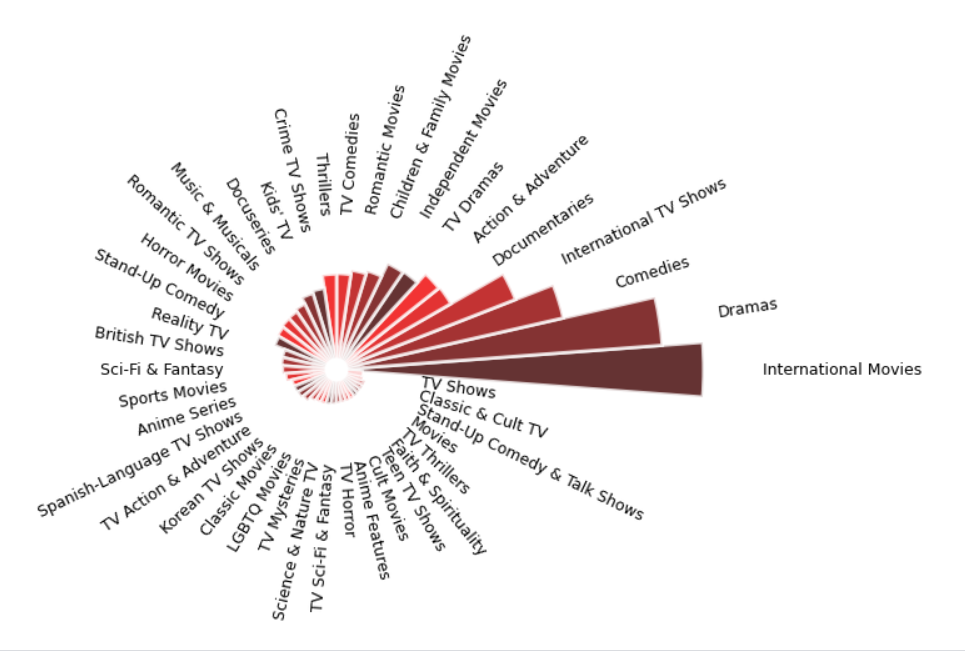
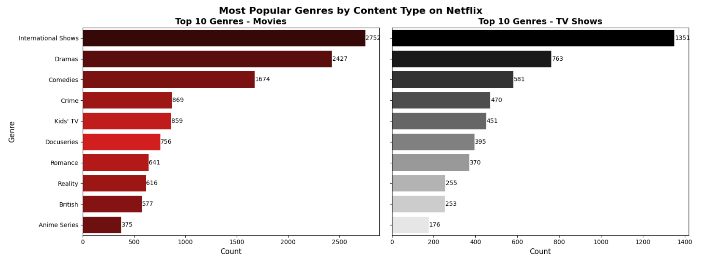
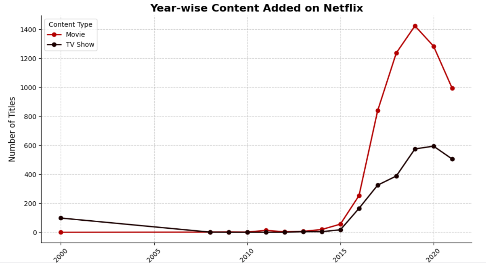

# Netflix-EDA-Plotly
## Introduction
This project analyzes Netflix's dataset of movies and TV Shows to explore trends, patterns,  and insights. By leveraging Python and Plotly, I created interactive visualizations to present key findings on the distribution of content, genres, ratings, release years, and more.


## Features
- [x] Comprehensive analysis of Netflix's dataset.
- [ ] Key insights on content trends, type distribution, and region-based analysis.
- [ ] Eye-Catching visualization using Mathplotlib, seaborn.

## Dataset
The dataset is sourced from Kaggle !().
It contains the following key columns:

- **Title:** Name of the movie or TV show.
- **Type:** Indicates whether the title is a Movie or a TV Show.
- **Genre:** Categories or genres of the content.
- **Release Year:** Year the content was released.
- **Country:** Country of origin.
- **Duration:** Runtime for movies and seasons for TV shows.
- **Rating:** Parental guidelines for the content.
- **Description:** Brief overview of the title.
- **Year added:** Content added on Netflix.

## Project Highlights
- **Data Cleaning:** Dealt with missing values and ensured the dataset is analysis-ready.
- **Content Type Analysis:** Explored the distribution of Movies vs TV Shows on Netflix.
- **Genre Insights:** Identified popular genres and their prevalence.
- **Release Year Trends:** Visualized the production trends over the years.
- **Country Analysis:** Mapped the geographical distribution of Netflix's content.
- **Ratings Breakdown:** Analyzed the distribution of ratings across content.
- Analyzed some key Metrics:
  1. Content Personalization
  2. Seasonality Analysis
  3. Age-appropriate Enagement
  4. Localization

## Tools and Libaries Used
- **Python**
  - Pandas: Data Manipulation and cleaning
  - Numpy: Numerical computations
  - Matplotlib: Supporting plots
- **Kaggle Notebook:** Development Enviornment

## How to Run the Project:
1. Clone the repository:
   ```bash
   git clone https://github.com/Ramya-pintchy/Netflix-EDA-Plotly.git
2. Install the required dependencies:
   ```bash
   pip install -r requirements.txt
3. Run the Kaggle notebook or Python Script to view the analysis.

## Some of the visualizations:
1. Top 10 countries contributing to the content of netfix.
   
2. Popular genre types
   
3. Top 10 countries contributing to the individual age category.
   
4. Top genres of Movies vs TV Shows contributing individually to the Netflix content.
   
